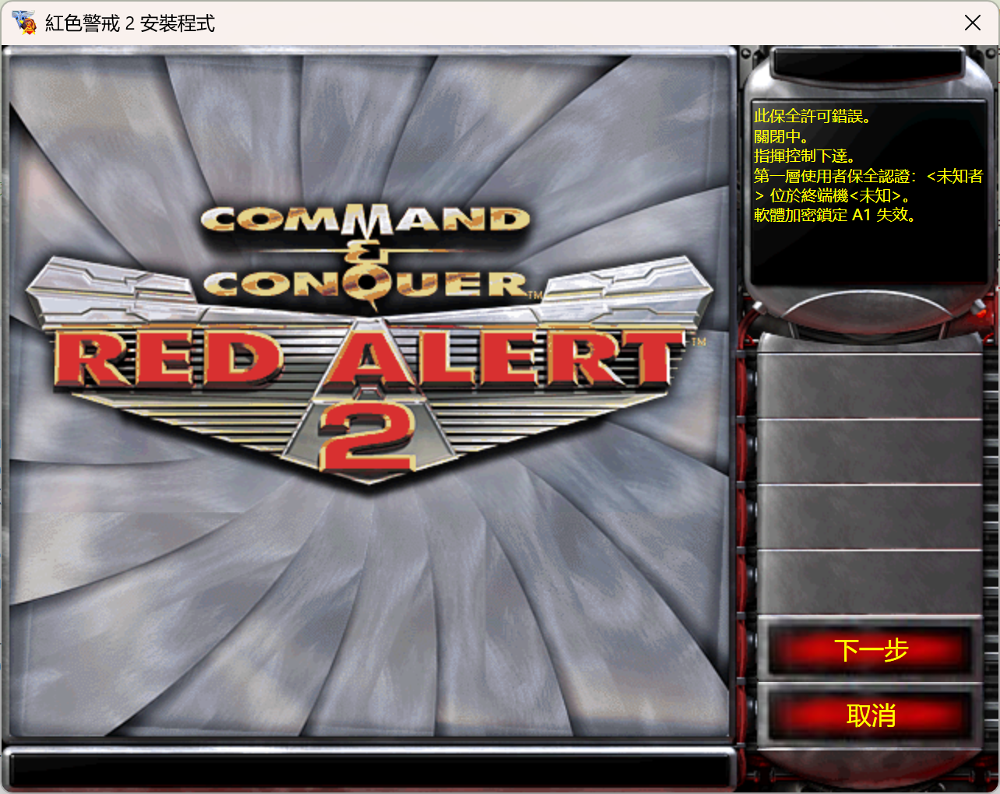

# 红警 2 安装程序重制版

语言：[English](README.md) | 中文

支持系统：

使用 [TRAE.AI](https://www.trae.cn) 重制 2000 年的经典游戏《红色警戒2》的安装程序。让新时代的玩家在现代电脑上也能体验到当年安装程序的怀旧乐趣，包括经典的音乐、动画、文案以及富有仪式感的交互体验。吸引更多新玩家加入，一起开启经典游戏的美好时光。

## 运行环境

- **系统要求**：Windows 7（32 位或 64 位） 或更高版本

## 使用方法

访问本项目的 Releases 页面，下载最新版本的可执行文件。

## 功能特点

### 界面复刻
- 完整复刻原版安装程序的视觉风格和交互流程
- 保留经典的音乐、动画和文案元素
- 重现当年安装过程的仪式感

### 功能增强
- **安装方式升级**：原版仅支持光盘安装，重制版支持现代流行的硬盘安装方式
- **语言支持优化**：解决原版繁体中文在简体操作系统上显示为英文的问题，完美支持简体中文系统
- **现代系统兼容**：适配 Windows 7 及以上现代操作系统

## 开发指南

### 开发环境

- **系统**：Windows 11
- **.NET 版本**：6.0
- **IDE**：Visual Studio 2022
- **AI 开发工具**：TRAE

### 项目结构

- **Assets/**：存放游戏资源文件，包括图片、音频、视频等
- **Resources/**：应用程序资源，包括多语言字符串文件
- **MainWindow.xaml.cs**：主窗口代码
- **RA2Installer.csproj**：项目配置文件

### 使用方法

1. 克隆或下载项目源码
2. 使用 Visual Studio 2022 打开项目
3. 确保安装了 .NET 6.0 开发环境
4. 构建并运行项目

### 贡献指南

欢迎各位开发者贡献代码和提出建议，共同完善这个项目。如有问题或建议，请提交 Issue 或 Pull Request。

### 许可证

本项目采用开源许可证，详见 `LICENSE` 文件。

## 致谢

- 感谢 Westwood 创作的经典游戏《红色警戒2》，请力所能及支持正版：[Steam 购买](https://store.steampowered.com/app/2229850/_2/?l=schinese) | [EA 购买](https://www.ea.com/zh-hant/games/command-and-conquer/command-and-conquer-the-ultimate-collection)
- 感谢 [TRAE.AI](https://www.trae.cn) 提供的强大编程能力，让不会 dotnet 的人也能开发出这个项目

---

**让我们一起重温经典，致敬那个美好的游戏时代！**